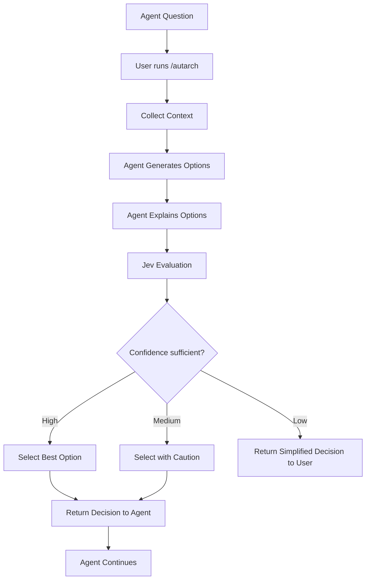
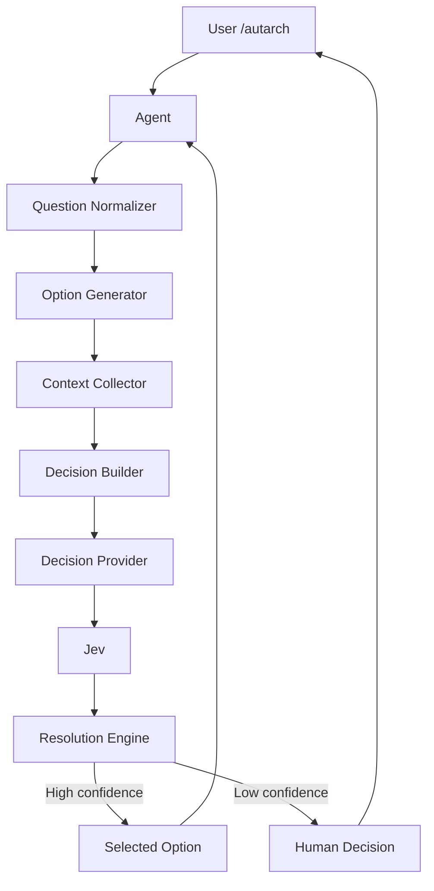

# Autarch 要件定義書

**文書種別:** Software Requirements Specification (SRS)
**プロジェクト名:** Autarch
**バージョン:** 0.2.0-draft
**作成日:** 2026-09-30
**ステータス:** Draft
**初期ユースケース:** コーディングエージェントから提示された技術的な選択への代理判断
**将来像:** 任意分野の「分からないとき」に呼び出し、エージェントが候補を作り、Jev が評価して最適案を選ぶ、汎用の意思決定支援スキル

---

## 1. 要約 — `/autarch` 一発で、判断そのものを AI に委譲する

Autarch は、ユーザーが判断に迷ったときに明示的に呼び出す、汎用の意思決定支援スキルである。

コーディングエージェントが「A と B のどちらにしますか？」と聞いてくる場面を考える。ユーザーがやることは `/autarch` の実行だけで、あとは Autarch が次の流れをすべて処理する。

1. 現在の質問と会話の文脈を取得する
2. エージェント（Agent）に合理的な選択肢を複数生成させる
3. 各選択肢の前提・利点・欠点を整理する
4. 判断に必要な周辺情報を集める
5. 評価専用モデル Jev に候補を評価させる
6. Jev が返す確率（probability）と確信度（confidence）を考慮して最適候補を選ぶ
7. 確信が十分なら、その選択で Agent に続行させる
8. 確信が足りないときだけ、判断をユーザーへ戻す

本書では、以降この作業主体を Agent と表記する。実際のやり取りは次のようになる。

```text
Agent:
「DBはPostgreSQLとSQLiteの
どちらにしますか？」

User:
/autarch

Autarch:
SQLiteを選択した。
現在の要件はローカル単一ユーザー用途で、
外部DBサーバーを必要としないため。
Jev confidence: 93%

Agent:
了解。SQLiteで実装を続ける。
```

ユーザーは技術的な正解を知らなくてよい。**判断そのものを AI ワークフローへ委譲できる**ことこそ、Autarch の中心的な価値である。

プロダクトステートメントは次の一文。

> **Autarch turns uncertainty into structured decisions.**

日本語ではこう定義する。

> Autarch は、ユーザーが判断に迷ったとき、エージェントが候補を作り、Jev が評価し、最も合理的な選択を導く意思決定支援スキルである。

---

## 2. 解決する課題: 技術判断を迫られて、作業が止まる

非エンジニアがコーディングエージェントを使っていると、作業の途中で技術的な選択を突きつけられる。データベースは SQLite と PostgreSQL のどちらか、認証は JWT と Session Cookie のどちらか、テストは Jest と Vitest のどちらか、API は REST と GraphQL のどちらか。新しい依存関係を追加するか、A案とB案のどちらの設計にするか、という問いも同じだ。

ユーザーに十分な技術知識がなければ合理的な比較ができず、開発フローはそこで停止する。Agent は待っており、次に進むにはどれかを選ぶしかない。

この問題は開発の外でも同じ構造で現れる。候補は複数ある。だが専門知識が足りず、比較軸が分からない。だからどれを選ぶべきか判断できない。Autarch は、この状態（unstructured uncertainty）を決定（decision）へ変換する。変換は二段階を経る。まず構造化された選択肢（structured alternatives）を作り、次に構造化された評価（structured evaluation）にかける。

---

## 3. コーディングに限らない Universal Decision Skill を目指す

対象を開発用途に限定しない。判断に迷う場面であれば適用できる範囲は広い。ソフトウェア設計、ツールや SaaS の選定、購入候補の比較、旅行プラン、学習方法、業務フロー、文書構成、施策案の比較、プロジェクトの優先順位などがその例だ。

たとえば次のような使い方を想定している（評価方式の詳細は §5）。

```text
開発      PostgreSQL と SQLite どちら？  → /autarch → 要件と context の整理 → SQLite
SaaS選定  Notion / Obsidian / Google Docs → 利用目的・共同編集・オフライン等を整理 → Jev Choice
旅行      新幹線・飛行機・車             → 時間・費用・人数等を整理 → Jev Score + Choice
業務      自動化・外注・内製             → 条件整理 → Jev Choice
```

将来は、エージェントの質問を待たず、ユーザー自身の「これどれがいいか分からない」という迷いから直接起動できることも視野に入れる。最終的に目指すのは、**人間が「何を基準に選べばいいか分からない」瞬間を、構造化された意思決定へ変換すること**である。

---

## 4. 設計の三原則

### 4.1 ユーザーが呼んだときだけ動く（User-Initiated）

初期版で自動発動はしない。ユーザーが `/autarch` を実行したときにだけ動作する。

### 4.2 Agent が作り、Jev が決める（Agent Generates, Jev Decides）

役割は 3 つに分離する。

- **Agent** — 状況を理解し、候補を生成し、必要な情報を調査し、候補と最終結果の説明を書く。判断の素材を作る側。
- **Jev** — 候補を比較して選択し、確率と confidence を返し、必要に応じてスコアを付ける。判断を評価する側。
- **Autarch** — 前の 2 者をオーケストレーションする。Decision Flow を管理し、閾値を適用し、結果を Agent に返す。

### 4.3 Jev には評価だけを任せる

Jev に「この問題の最適解を自由に考えてください」と投げるのは避ける。問題の解決そのものは、Agent が合理的な候補を作ることで担う。Jev は、その候補を Choice または Score で評価する役に専念させる（各方式の詳細は §5）。

---

## 5. Jev の使い方: Choice が主、Score と Noul が補助

Jev は、TypeSafe AI が「System One Models」として提供する評価専用のモデルで、候補を比べて確率つきの答えを返す（→ 参考資料）。2026-09-30 時点の TypeSafe AI API では `POST /v1/systemone` と `GET /v1/models` が公開されており、Jev に渡す質問形式である Question 型として、次の 3 種が使える。

### Choice — 候補から最適な 1 つを選ぶ

主判定方式。複数の候補から最適なものを 1 つ選ばせる。候補比較、最終選択、選択肢の数が多い場面（高 cardinality）で使う。

### Score — 評価軸ごとに採点する

必要に応じて、候補を評価軸ごとに採点させる。軸の例は保守性（Maintainability）、実装難度（Implementation difficulty）、セキュリティ（Security）、コスト（Cost）、互換性（Compatibility）。比較理由の可視化、複数基準によるランキング、Choice 結果の補足、そして将来的な Decision Matrix に使う。

### Noul — Yes / No で答える

Yes / No 型の判断に使う。たとえば次のような質問を投げる。

```text
Can this question be resolved from technical evidence?
Does this decision require personal preference?
Is there enough evidence to select automatically?
```

（この質問は技術的根拠だけで解決できるか／この決定に個人の好みが必要か／自動選択できるだけの根拠があるか）

---

## 6. 決定は 9 ステップの Decision Flow で進む



各ステップの中身は次のとおり。

### Step 1 — Capture Question

現在の Agent 質問を取得する。取得対象は質問本文、会話の文脈、ユーザーの目的（question / context / user_goal）。

### Step 2 — Normalize Decision

質問を意思決定問題（Decision Problem）へ変換する。

```text
元の質問:  「JWTとCookieどちらにしますか？」

Decision:  Select the authentication state strategy
           that best matches the current project.
```

### Step 3 — Generate Alternatives

Agent が原則 3 個（最低 2、最大 5）の候補を作る（→ §7）。候補は実際に採用可能で、明らかなダミー候補や同じ案の言い換えを含まない。必要なら現状維持を候補に含める。

### Step 4 — Gather Evidence

判断に必要な情報を収集する。開発用途では、たとえば次のような情報が対象になる。

```text
repository structure / package.json / existing dependencies / architecture
/ tests / README / configuration / current implementation / user requirements
/ deployment target / security constraints
```

### Step 5 — Build Decision State

Step 1〜4 で集めた内容を、Jev に渡す state として構築する。

```yaml
goal:             # ユーザーの当初目的
question:         # Step 2 で正規化した Decision Problem
known_constraints:
environment:
evidence:         # Step 4 で収集した情報
alternatives:     # Step 3 で生成した候補
```

### Step 6 — Jev Evaluation

標準では Choice を使用する。必要に応じて Score を追加する（→ §8）。

### Step 7 — Confidence Gate

出力の confidence を閾値で評価する（→ §9）。

### Step 8 — Resolve

confidence に応じて、`SELECT_OPTION` / `SELECT_OPTION_WITH_CAUTION` / `ASK_USER` のいずれかを選ぶ（→ §9）。

### Step 9 — Return to Agent

選択結果を Agent に返し、作業を継続する。

---

## 7. 候補は 2〜5 個、本質的に異なる案だけを作る

候補数は最低 2、目標 3、最大 5 とする。

```yaml
min_options: 2
target_options: 3
max_options: 5
```

各候補は次の形式で持つ。

```yaml
id:             # 一意な識別子
name:           # 表示名
description:    # 短い説明
advantages:     # 利点
disadvantages:  # 欠点
assumptions:    # 採用の前提となる条件
```

候補の品質要件は 5 つある。

- 本質的に異なること（materially different）
- 技術的に実行可能であること
- ユーザーの目的に関連すること
- 十分に具体的であること
- 特定の答えへ意図的に偏らせていないこと

---

## 8. 標準は Simple Choice、複雑なときだけ Score を足す

### Simple Choice Mode

MVP の標準。候補をそのまま Jev の Choice に渡し、最上位候補を得る。

### Scored Choice Mode

複数の評価軸が必要な場合のモード。各軸で Score を取って集計し、それから Choice に渡す。重みの例は次のとおり。

| Criteria | Weight |
|---|---:|
| Requirement fit | 35% |
| Simplicity | 20% |
| Maintainability | 20% |
| Risk | 15% |
| Cost | 10% |

### Human Preference Mode

客観的な正解よりも好みが支配的な場面では、Autarch は勝手に選ばずユーザーへ戻す。デザインの好み、ブランド名、文章のトーン、趣味の選択、価値観に依存する選択がこれに当たる。

---

## 9. 自動採用の条件: confidence ポリシー

Jev の回答には、各候補が選ばれる度合いである probability と、回答全体に対する Jev 自身の確信度である confidence が含まれる。ただし、常に最上位候補を自動採用するわけではない。confidence と、1 位と 2 位の確率の差（probability gap）で、採用するか・人に戻すかを決める。TypeSafe 自身も、confidence が高い場合はソフトウェアが自律的に処理し、低い場合は review へ回すワークフローを想定しており、以下のポリシーはこの想定をそのまま踏襲する。初期値は次のとおり。

```yaml
confidence:
  auto_select: 0.85
  review: 0.60

minimum_probability_gap: 0.15
```

| confidence | 動作 |
|---|---|
| 0.85 以上 | `SELECT_OPTION` — 自動採用する |
| 0.60 以上 0.85 未満 | `SELECT_OPTION_WITH_CAUTION` — 注意つきで採用する |
| 0.60 未満 | `ASK_USER` — ユーザーへ判断を戻す |

判定はまず confidence の帯域で行う。そのうえで、1 位と 2 位の確率の差が `minimum_probability_gap`（0.15）未満に狭い場合は、confidence が十分でもユーザーへ戻せる。

---

## 10. 判断を人へ戻すとき: 答えやすい最小質問へ変換する

判断できない場合は、元の質問をそのままユーザーへ戻してはならない。「JWTとCookieどちらにしますか？」と繰り返すのは、ユーザーが最初に答えられずにいた質問と同じだからだ。

代わりに、候補に短い特徴を付けて並べ、違いが効いてくる質問を 1 つに絞って聞く。

```text
Autarchでは明確な優位性を判定できなかった。

A. JWT
- 外部APIや複数クライアントに向く
- 管理がやや複雑

B. Session Cookie
- 現在のWeb構成に単純
- 同一Webアプリ向け

今回の違いは、将来モバイルアプリや外部APIを提供する
予定があるかに依存する。

その予定があるかだけ指定してほしい。
```

UX 原則は 8 か条だ。

1. ユーザーに専門知識を要求しない
2. 候補を増やしすぎない
3. 判断根拠は短くする
4. 確信が低い場合は隠さない
5. 「AIが選んだから正しい」と扱わない
6. ユーザーがいつでも override できるようにする
7. 元の作業フローを止めすぎない
8. `/autarch` の後は、可能ならそのまま Agent の作業を再開する

---

## 11. 機能要件

本節は全機能要件の列挙であり、MVP で実装する範囲は §18 のスコープに従う。要件は ID で管理する。

### Invocation

- `FR-INV-001` — ユーザーが `/autarch` でスキルを明示実行できること。
- `FR-INV-002` — 直前に Agent が提示した質問を取得できること。
- `FR-INV-003` — 必要に応じて質問を明示引数として渡せる構造にすること。

### Context

- `FR-CTX-001` — 現在の会話コンテキストを取得できること。
- `FR-CTX-002` — ユーザーの当初目的を取得できること。
- `FR-CTX-003` — 開発用途では repository 情報を参照できること。
- `FR-CTX-004` — 不要な情報を Jev へ送信しないこと。

### Option Generation

- `FR-OPT-001` — Agent は最低 2 候補を生成すること。
- `FR-OPT-002` — デフォルトは 3 候補とすること。
- `FR-OPT-003` — 各候補に短い説明を付けること。
- `FR-OPT-004` — 明らかに不合理な候補を除外すること。
- `FR-OPT-005` — 既存質問に 2 択が含まれる場合も、必要なら第三案を追加できること。

### Jev Evaluation

- `FR-JEV-001` — Choice を利用できること。
- `FR-JEV-002` — Score を利用できること。
- `FR-JEV-003` — Noul を利用できること。
- `FR-JEV-004` — Jev response を内部共通型へ変換すること。
- `FR-JEV-005` — confidence と probability を保持すること。
- `FR-JEV-006` — Jev API 障害を処理すること。

### Resolution

- `FR-RES-001` — 最上位候補を特定できること。
- `FR-RES-002` — confidence threshold を適用できること。
- `FR-RES-003` — probability gap を評価できること。
- `FR-RES-004` — 十分な確信があれば Agent へ選択結果を返すこと。
- `FR-RES-005` — 確信不足ならユーザーへ判断を戻すこと。

---

## 12. 出力仕様: Agent 向けとユーザー向けの 2 種

Agent へは判断の全容を JSON で返す。

```json
{
  "decision": "SELECT_OPTION",
  "selected_option": "session_cookie",
  "confidence": 0.94,
  "probability": 0.87,
  "alternatives": [
    {"id": "jwt", "probability": 0.08},
    {"id": "session_cookie", "probability": 0.87},
    {"id": "oauth_session", "probability": 0.05}
  ],
  "reason": "Best fit for the current browser-only same-origin architecture."
}
```

ユーザーへは要約を短文で返す。

```text
Autarch: Session Cookie を選択。
現在の構成との適合性が最も高い。
Jev confidence: 94%

この選択でエージェントが続行する。
```

---

## 13. アーキテクチャ: コアは分野に依存しない



### コンポーネント

| コンポーネント | 責務 |
|---|---|
| Invocation Layer | `/autarch` を受け付ける |
| Question Normalizer | 曖昧な質問を明確な Decision Problem へ変換する |
| Option Generator | Agent を使って合理的な候補を作る |
| Context Collector | 判断に必要な情報を取得する |
| Decision Builder | Jev 用の state / questions を構築する |
| Jev Adapter | TypeSafe API を抽象化する |
| Decision Provider | 評価を提供する外部モデル。初期実装は Jev |
| Resolution Engine | probability / confidence / policy で最終判断する |
| Domain Adapter | 分野固有の context 収集を担当する |

### 汎用化要件

Core はコーディング固有にしない。Core が扱うのは goal / question / context / constraints / options / criteria / decision の 7 キーからなる Generic Decision Schema だけである。

repository、package.json、test などの開発固有の情報は CodingAdapter の責務にする。将来は次のような Domain Adapter を分野ごとに追加する。

```text
CodingAdapter / ShoppingAdapter / TravelAdapter / BusinessAdapter
WritingAdapter / ResearchAdapter / GeneralAdapter
```

### Provider Independence

評価 Provider の初期実装は Jev だが、Core を Jev 専用にしない。将来的には LLM structured-output provider、local decision model、enterprise policy model へ差し替え可能にする。Decision Provider の概念仕様は次のとおり。

```python
class DecisionProvider:
    def choose(self, state, question, options):
        ...

    def score(self, state, question, scale):
        ...

    def noul(self, state, question):
        ...
```

---

## 14. 障害時は決定しない

| 状況 | 動作 |
|---|---|
| Jev API 障害 | `PROVIDER_UNAVAILABLE` — 自動決定しない |
| 合理的な候補を最低 2 件作れない | `INSUFFICIENT_OPTIONS` |
| confidence 不足 | `ASK_USER` — 自動選択せずユーザーへ戻す（§9） |

---

## 15. セキュリティとプライバシー

送信する情報は判断に必要な最小限に絞る。

次の情報は送信しない。

- password
- API key
- token
- private key
- credential
- secret file content

また、次の分野は自動選択の対象外にできる Policy を持つ。

- 医療
- 法律
- 金融取引
- 高額購入
- 重大な安全判断
- irreversible destructive action

---

## 16. 非機能要件

| 項目 | 要件 |
|---|---|
| Latency | 通常の Decision は数秒以内に完了する UX を目標とする |
| Explainability | 最終選択には selected option / probability / confidence / key evidence を最低限保持する |
| Extensibility | Domain Adapter と Decision Provider を交換可能にする |
| Testability | Jev API なしで mock provider を用いた unit test を可能にする |
| Observability | invocation count / decision count / auto-select count / human-return count / provider latency / provider cost / confidence distribution / option count を測定可能にする |

---

## 17. スキルへの実装指示

初期 Skill の核心 Instruction は次の 10 項目とする。

```text
When the user invokes /autarch:

1. Identify the unresolved decision currently blocking progress.
2. Restate it as a clear decision problem.
3. Generate 2-5 materially different and feasible options.
4. Gather only the context needed to compare those options.
5. Use Jev to evaluate the options.
6. Prefer Choice for final selection.
7. Use Score only when multiple evaluation dimensions materially improve the decision.
8. Do not invent certainty.
9. If confidence is below the configured threshold, return the decision to the user in simplified form.
10. If confidence is sufficient, select the best option and continue with it.
```

---

## 18. MVP スコープ

### Must Have

1. `/autarch`
2. 現在の質問取得
3. Question Normalizer
4. 2〜5 候補生成
5. Coding Context Collector
6. Jev Choice
7. confidence threshold
8. Agent への選択返却
9. low-confidence 時のユーザー返却
10. Jev API error handling
11. secret redaction
12. logging

### Should Have

1. Noul による「ユーザー意図が必要か」の事前判定
2. Score による複数軸評価
3. configurable threshold
4. mock provider
5. Decision history

### Could Have

1. GeneralAdapter
2. ShoppingAdapter
3. TravelAdapter
4. user preference profiles
5. weighted criteria
6. provider fallback
7. local provider

### Won't Have in MVP

- 完全自律型 Agent Control Runtime
- tool execution guardrail
- Git rollback
- self-repair loop
- production action approval
- organization policy engine
- automatic activation

---

## 19. 受け入れ基準

- `AC-001` — Agent から 2 択以上の技術質問を受けた状態で `/autarch` を実行できる。
- `AC-002` — Autarch が最低 2 つ、最大 5 つの合理的候補を作成できる。
- `AC-003` — 既存質問が 2 択でも、必要なら別候補を追加できる。
- `AC-004` — Jev Choice へ候補を渡し、候補ごとの評価を取得できる。
- `AC-005` — 最上位候補を識別できる。
- `AC-006` — confidence が設定閾値以上なら、その候補を Agent へ返せる。
- `AC-007` — confidence 不足なら、勝手に選ばずユーザーへ戻せる。
- `AC-008` — ユーザーへ戻す際、専門知識がなくても答えやすい質問へ変換できる。
- `AC-009` — Secret が Jev へ送信されない。
- `AC-010` — Jev API 障害時に誤って自動選択しない。

---

## 20. Autarch が効いているかは 4 つの率で測る

### KPI

次の 4 つを追跡する。

- Decision Completion Rate: Autarch が自力で解決した Decision ÷ Autarch 呼び出し総数
- Human Return Rate: ユーザー判断へ戻した Decision ÷ Autarch 呼び出し総数
- Override Rate: User Overrides ÷ Autarch Selections
- Task Continuation Rate: Autarch Decision 後、Agent が追加質問なしで作業を継続できた割合

### Eval Design

評価用のケース例として、次の 10 種を用意する。

- Database choice
- Authentication strategy
- Testing framework
- Caching strategy
- Deployment option
- Dependency choice
- API style
- UI library
- File format
- Architecture pattern

各ケースの基準情報には、reasonable_options（合理的な候補の集合）、preferred_option（望ましい選択）、acceptable_alternatives（許容できる代替）、requires_human_preference（人間の好みが必要か）の 4 つを定義する。

評価項目は 5 つ。

- 適切な候補を生成できたか
- 明らかな悪手を候補に入れていないか
- Jev の選択は妥当か
- confidence は妥当か
- 人間判断が必要なケースを自動決定していないか

---

## 21. 将来ロードマップ

### Phase 1 — Coding Decision Skill

`/autarch` でコーディングの質問に候補を作り、Jev Choice で決定する。本書の MVP がこれに当たる。

### Phase 2 — Rich Evaluation

Noul、Score、weighted criteria、confidence policies を追加する。さらに evidence 収集を強化する。

### Phase 3 — General Decision Skill

CodingAdapter 依存を外し、GeneralAdapter を追加する。

### Phase 4 — Domain Packs

Autarch Coding / Travel / Shopping / Business / Research を展開する。

### Phase 5 — Preference-Aware Decisions

ユーザーが明示的に設定した好み・制約を Decision State へ組み込む。たとえば次のような設定だ。

```text
prefer simplicity / prefer lower cost
avoid subscriptions / prefer open source
```

### Phase 6 — Decision Learning

過去のユーザー override を将来の候補評価の改善に使う。ただし、この利用をユーザーが制御できることを必須とする。

---

## 22. 付録

### 推奨初期ディレクトリ構成

```text
autarch/
├── README.md
├── pyproject.toml
├── src/
│   └── autarch/
│       ├── core/
│       │   ├── resolver.py
│       │   ├── decision.py
│       │   └── thresholds.py
│       ├── providers/
│       │   ├── base.py
│       │   └── jev.py
│       ├── domains/
│       │   ├── base.py
│       │   └── coding.py
│       ├── context/
│       │   ├── collector.py
│       │   └── redaction.py
│       ├── options/
│       │   └── generator.py
│       ├── evals/
│       │   └── runner.py
│       └── cli/
│           └── main.py
├── skills/
│   └── autarch/
│       └── SKILL.md
├── evals/
└── tests/
```

### 内部 Decision Object

```json
{
  "question": "Which authentication strategy should be used?",
  "mode": "choice",
  "options": [
    {"id": "jwt", "label": "JWT"},
    {"id": "session_cookie", "label": "Session Cookie"},
    {"id": "oauth_session", "label": "OAuth Session"}
  ],
  "result": {
    "selected_option": "session_cookie",
    "confidence": 0.94,
    "probabilities": {
      "jwt": 0.08,
      "session_cookie": 0.87,
      "oauth_session": 0.05
    }
  },
  "resolution": "SELECT_OPTION"
}
```

### コマンド仕様

MVP では `/autarch` 一本にする。将来は `/autarch choose`、`/autarch compare`、`/autarch explain` の追加を検討する。

---

## 23. 参考資料

2026-09-30 時点の TypeSafe AI 公式情報を参照。

- TypeSafe AI — Introducing System One Models & Jev: https://typesafe.ai/blog/introducing-system-one-models-and-jev
- TypeSafe AI — Official Site: https://typesafe.ai/
- TypeSafe AI — API Documentation: https://api.typesafe.ai/docs

公式情報上、Jev は System One Model として、非構造データを入力し、型付きの確率的 decision を返す設計である。現行 API で主に利用できるのは Choice、Score、Noul の 3 種だ（§9 の confidence ポリシーは、TypeSafe が想定する「高 confidence は自律処理、低 confidence は review」のワークフローを踏襲している）。

---

## 変更履歴

| Version | Date | Description |
|---|---|---|
| 0.1.0-draft | 2026-09-30 | Autonomy Runtime 案 |
| 0.2.0-draft | 2026-09-30 | User-invoked Universal Decision Skill へ再定義 |
